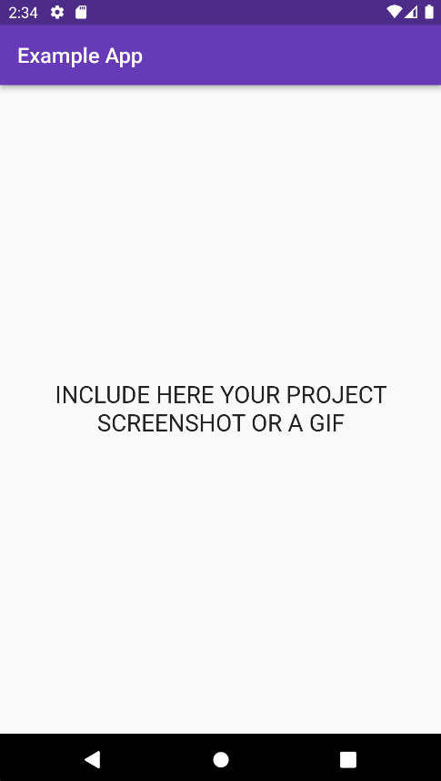

<a name="readme-top"></a>


<h1 align="center">PROJECT TITLE - Optional: slogan/small description.</h1>

<!-- PROJECT LOGO -->
<br />
<div align="center">
  <!-- You should link the logo to the pub dev page of you project or a homepage otherwise -->
  <a href="https://pub.dev/publishers/flutterando.com.br/packages">
    
  </a>

  <p align="center">
    This project is meant to be used as a template for the Flutterando community projects. Here you can put a brief explanation of what is the project about
    <br />
    <!-- Put the link for the documentation here below -->
    <a href="https://pub.dev/publishers/flutterando.com.br/packages"><strong>Explore the docs »</strong></a>
    <br />
    <br />
    <!-- Disable unused links with with comments -->
    <a href="https://pub.dev/publishers/flutterando.com.br/packages">View Demo</a>
    ·
    <!-- The Report Bug and Request Feature should point to the issues page of the project, in this example we use the Asuka page -->
    <a href="https://github.com/Flutterando/asuka/issues">Report Bug</a>
    ·
    <a href="https://github.com/Flutterando/asuka/issues">Request Feature</a>
  </p>

<br>

<!--  SHIELDS  ---->


<!-- The shields here are an example of what could be used and are the most recommended, there are more below in the "some recomendations about shields" section. 
See the links in the example below, changing the parts after img.shields.io you can change the content of the shields. Alternatively, go to the website and generate new shields.  

The ones used here are:
- Release version
- License
- Pub Points (there are also shields for Pub Popularity and Pub Likes)
- Number of Contributors
- Number of Forks --->

[](https://pub.dev/packages/asuka)
[](https://github.com/Flutterando/asuka/blob/master/LICENSE)
[](https://pub.dev/packages/asuka/score)
[](https://github.com/Flutterando/asuka/graphs/contributors)
[](https://github.com/Flutterando/asuka/graphs/contributors)

<!---- We suggest to not change the last two for Flutterando projects 

- Package Publisher
- YouTube Channel 
--->
[](https://pub.dev/publishers/flutterando.com.br/packages)
[](https://www.youtube.com/flutterando)
</div>

<!----
About Shields, some recommendations:
+-+
Build - GithubWorkflow ou Github Commit checks state
CodeCoverage - Codecov
Chat - Discord 
License - Github
Rating - Pub Likes, Pub Points and Pub Popularity (if still in early stages, we recommend only Pub Points since it's controllable)
Social - GitHub Forks, Github Org's Stars (if using Flutterando as the main org), YouTube Channel Subscribers (Again, using Flutterando, as set in the example)
--->

<br>

<!-- TABLE OF CONTENTS -->
<!-- Linked to every ## title below -->
<details>
  <summary>Table of Contents</summary>
  <ol>
    <li><a href="#about-the-project">About The Project</a></li>
    <li><a href="#sponsors">Sponsors</a></li>
    <li><a href="#getting-started">Getting Started</a></li>
    <li><a href="#how-to-use">How to Use</a></li>
    <li><a href="#features">Features</a></li>
    <li><a href="#contributing">Contributing</a></li>
    <li><a href="#license">License</a></li>
    <li><a href="#contact">Contact</a></li>
    <li><a href="#acknowledgements">Acknowledgements</a></li>
  </ol>
</details>

<br>

<!-- ABOUT THE PROJECT -->
## About The Project


<!-- PROJECT EXAMPLE (IMAGE) -->

<br>
<Center>

</Center>

<br>

<!-- PROJECT DESCRIPTION -->

Here you can write lenghtier descriptions of your project, going deeper about it's uses, how it came to be, aims, and whatever more is necessary for the client/user to understand it. 

Be aware that you need to be direct, since this Readme is oriented to guide rather than teach how to use the project. 

Anything more and you should point to the official documentation of your project.


<p align="right">(<a href="#readme-top">back to top</a>)</p>

<!-- SPONSORS -->
<!-- For now FTeam is the only sponsor for Flutterando packages. The community is open to more support for it's open source endeavors, so check it out and make contact with us through the links provided at the end -->
## Sponsors

<a href="https://fteam.dev">
    
  </a>

<p align="right">(<a href="#readme-top">back to top</a>)</p>
<br>


<!-- GETTING STARTED -->
## Getting Started

<!---- The description provided below was aimed to show how to install a pub.dev package, change it as you see fit for your project ---->
To get your_package in your project follow either of the instructions below:

a) Add your_package as a dependency in your Pubspec.yaml:
 ```yaml
   dependencies:
     your_package: any
``` 

b) Use Dart Pub:
```sh
  dart pub add your_package
```

<br>


## How to Use

<!---- In this section, provide a simple and short explanation of the base use of your project and a link to your documentation for more advanced uses --->

Add the following code where you call your Material App:

```dart
import 'package:your_package/your_package.dart';

MaterialApp(
    builder: YourPackage.builder,
    navigatorObservers: [
       YourPackage.packageController 
       //Include observations for your users when it's an important point in the usage
    ],
);
``` 
Now you just have to call the named constructors for each widget that you want to use: 

```dart
import 'package:your_package/your_package.dart';

YourPackage.doesSomething(
    content: Text("Hello World"),
);

YourPackage.success("success").show();
```

<br>

_For more examples, please refer to the_ [Documentation]() 

<!---- You can use the emoji 🚧 to indicate Work In Progress sections ---->

<p align="right">(<a href="#readme-top">back to top</a>)</p>

<!-- FEATURES -->

<!---- Use this section to highlight your features and show  what is under progress. Use emojis for better communication if needed ---->
## Features

- ✅ Main Feature
- ✅ Side Feature
- ✅ Other Feature
- 🚧 Documentation
- 🚧 Other Features 

<!---- 
We suggest, in case of the roadmap of features has been completed, to include the text below:

Right now this package has concluded all his intended features. If you have any suggestions or find something to report, see below how to contribute to it. 
---->


<p align="right">(<a href="#readme-top">back to top</a>)</p>


<!-- CONTRIBUTING -->
## Contributing
 
🚧 [Contributing Guidelines]() - _Currently being updated_ 🚧
<!---- Flutterando Contributing Guidelines are currently a work in progress.
We recommend to keep the text below the way it is. 
 --->

Contributions are what make the open source community such an amazing place to learn, inspire, and create. Any contributions you make are **greatly appreciated**.

If you have a suggestion that would make this better, please fork the repo and create a pull request. You can also simply open an issue with the appropriate tag. 
Don't forget to give the project a star! Thanks again!

1. Fork the Project
2. Create your Feature Branch (`git checkout -b feature/AmazingFeature`)
3. Commit your Changes (`git commit -m 'Add some AmazingFeature'`)
4. Push to the Branch (`git push origin feature/AmazingFeature`)
5. Open a Pull Request

Remember to include a tag, and to follow [Conventional Commits](https://www.conventionalcommits.org/en/v1.0.0/) and [Semantic Versioning](https://semver.org/) when uploading your commit and/or creating the issue. 

<p align="right">(<a href="#readme-top">back to top</a>)</p>


<!-- LICENSE -->
## License

Distributed under the MIT License. See `LICENSE.txt` for more information.

<p align="right">(<a href="#readme-top">back to top</a>)</p>


<!-- CONTACT -->

<!---- Those are the current Flutterando contacts as of 25 August 2022 --->
## Contact

Flutterando Community
- [Discord](https://discord.gg/qNBDHNARja)
- [Telegram](https://t.me/flutterando)
- [Website](https://www.flutterando.com.br)
- [Youtube Channel](https://www.youtube.com.br/flutterando)
- [Other useful links](https://linktr.ee/flutterando)


<p align="right">(<a href="#readme-top">back to top</a>)</p>

<!-- ACKNOWLEDGEMENTS -->
## Acknowledgements 


Thank you to all the people who contributed to this project, whitout you this project would not be here today.

<br>

<!---- Change the link below to the contributors page of your project and change the repo= in the img src to properly point to your repository -->

<a href="https://github.com/flutterando/asuka/graphs/contributors">
  
</a>

<!-- Here is an alternative to the contributors page: https://allcontributors.org/
And the link for the currently used option in this readme: https://contrib.rocks/ -->


<p align="right">(<a href="#readme-top">back to top</a>)</p>

<!-- MANTAINED BY -->
## Maintaned by

---

<br>
<p align="center">
  <a href="https://www.flutterando.com.br">
    
  </a>
  <p align="center">
    Built and maintained by <a href="https://www.flutterando.com.br">Flutterando</a>.
  </p>
</p>


<!-- MARKDOWN LINKS & IMAGES -->
<!-- https://www.markdownguide.org/basic-syntax/#reference-style-links -->

<!-- [Choose an Open Source License](https://choosealicense.com)
[GitHub Emoji Cheat Sheet](https://www.webpagefx.com/tools/emoji-cheat-sheet)
[Malven's Flexbox Cheatsheet](https://flexbox.malven.co/)
[Malven's Grid Cheatsheet](https://grid.malven.co/)
[Img Shields](https://shields.io)
[GitHub Pages](https://pages.github.com)
[Font Awesome](https://fontawesome.com)
[React Icons](https://react-icons.github.io/react-icons/search) 

[contributors-shield]: https://img.shields.io/github/contributors/othneildrew/Best-README-Template.svg?style=for-the-badge
[contributors-url]: https://github.com/othneildrew/Best-README-Template/graphs/contributors
[forks-shield]: https://img.shields.io/github/forks/othneildrew/Best-README-Template.svg?style=for-the-badge
[forks-url]: https://github.com/othneildrew/Best-README-Template/network/members
[stars-shield]: https://img.shields.io/github/stars/othneildrew/Best-README-Template.svg?style=for-the-badge
[stars-url]: https://github.com/othneildrew/Best-README-Template/stargazers
[issues-shield]: https://img.shields.io/github/issues/othneildrew/Best-README-Template.svg?style=for-the-badge
[issues-url]: https://github.com/othneildrew/Best-README-Template/issues
[license-shield]: https://img.shields.io/github/license/othneildrew/Best-README-Template.svg?style=for-the-badge
[license-url]: https://github.com/othneildrew/Best-README-Template/blob/master/LICENSE.txt
[linkedin-shield]: https://img.shields.io/badge/-LinkedIn-black.svg?style=for-the-badge&logo=linkedin&colorB=555
[linkedin-url]: https://linkedin.com/in/othneildrew
[product-screenshot]: images/screenshot.png
[Next.js]: https://img.shields.io/badge/next.js-000000?style=for-the-badge&logo=nextdotjs&logoColor=white
[Next-url]: https://nextjs.org/
[React.js]: https://img.shields.io/badge/React-20232A?style=for-the-badge&logo=react&logoColor=61DAFB
[React-url]: https://reactjs.org/
[Vue.js]: https://img.shields.io/badge/Vue.js-35495E?style=for-the-badge&logo=vuedotjs&logoColor=4FC08D
[Vue-url]: https://vuejs.org/
[Angular.io]: https://img.shields.io/badge/Angular-DD0031?style=for-the-badge&logo=angular&logoColor=white
[Angular-url]: https://angular.io/
[Svelte.dev]: https://img.shields.io/badge/Svelte-4A4A55?style=for-the-badge&logo=svelte&logoColor=FF3E00
[Svelte-url]: https://svelte.dev/
[Laravel.com]: https://img.shields.io/badge/Laravel-FF2D20?style=for-the-badge&logo=laravel&logoColor=white
[Laravel-url]: https://laravel.com
[Bootstrap.com]: https://img.shields.io/badge/Bootstrap-563D7C?style=for-the-badge&logo=bootstrap&logoColor=white
[Bootstrap-url]: https://getbootstrap.com
[JQuery.com]: https://img.shields.io/badge/jQuery-0769AD?style=for-the-badge&logo=jquery&logoColor=white
[JQuery-url]: https://jquery.com  -->
