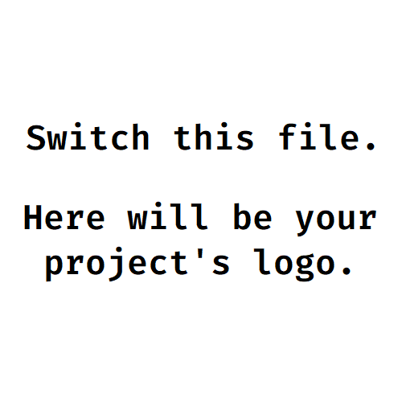

<div id="top"></div>
<!--
*** 感谢查看我们的最佳 README 模板，如果你有好的建议，请复刻（fork）本仓库并且创建一个
*** 拉取请求（pull request），或者直接创建一个带「enhancement」标签的议题（issue）。
*** 不要忘记给该项目点一个 star！
*** 再次感谢！现在快去创建一些了不起的东西吧！:D
-->


<!-- 项目 SHIELDS -->
<!--
*** 我们使用了 markdown 「参考风格」的链接以便于阅读。
*** 参考链接是用方括号 [ ] 包围起来的，而非 圆括号 ( )。
*** 请到文档末尾查看 contributors-url、forks-url 等变量的声明。这是一种可选的简洁语法，你可能会想要使用。
*** https://www.markdownguide.org/basic-syntax/#reference-style-links
-->
[![Contributors][contributors-shield]][contributors-url]
[![Forks][forks-shield]][forks-url]
[![Stargazers][stars-shield]][stars-url]
[![Issues][issues-shield]][issues-url]
[![MIT License][license-shield]][license-url]
[![LinkedIn][linkedin-shield]][linkedin-url]


<!-- 项目 LOGO -->
<br />
<div align="center">
  <a href="https://github.com/github_username/repo_name">
    
  </a>

<h3 align="center">项目标题</h3>

  <p align="center">
    项目简介
    <br />
    <a href="https://github.com/github_username/repo_name"><strong>浏览文档 »</strong></a>
    <br />
    <br />
    <a href="https://github.com/github_username/repo_name">查看 Demo</a>
    ·
    <a href="https://github.com/github_username/repo_name/issues">反馈 Bug</a>
    ·
    <a href="https://github.com/github_username/repo_name/issues">请求新功能</a>
  </p>
</div>


<!-- 目录 -->
<details>
  <summary>目录</summary>
  <ol>
    <li>
      <a href="#关于本项目">关于本项目</a>
      <ul>
        <li><a href="#构建工具">构建工具</a></li>
      </ul>
    </li>
    <li>
      <a href="#开始">开始</a>
      <ul>
        <li><a href="#依赖">依赖</a></li>
        <li><a href="#安装">安装</a></li>
      </ul>
    </li>
    <li><a href="#使用方法">使用方法</a></li>
    <li><a href="#路线图">路线图</a></li>
    <li><a href="#贡献">贡献</a></li>
    <li><a href="#许可证">许可证</a></li>
    <li><a href="#联系我们">联系我们</a></li>
    <li><a href="#致谢">致谢</a></li>
  </ol>
</details>


<!-- 关于本项目 -->
## 关于本项目

[![产品截图][product-screenshot]](https://example.com)

这是一个用于快速开始的空白模板：为了避免重复输入太多信息，请使用你的文本编辑器查找替换下面的内容：`github_username`, `repo_name`, `twitter_handle`, `linkedin_username`, `email_client`, `email`, `项目标题`, `项目简介`

<p align="right">(<a href="#top">回到顶部</a>)</p>


### 构建工具

* [Next.js](https://nextjs.org/)
* [React.js](https://reactjs.org/)
* [Vue.js](https://vuejs.org/)
* [Angular](https://angular.io/)
* [Svelte](https://svelte.dev/)
* [Laravel](https://laravel.com)
* [Bootstrap](https://getbootstrap.com)
* [JQuery](https://jquery.com)

<p align="right">(<a href="#top">回到顶部</a>)</p>


<!-- 开始 -->
## 开始

这是一份在本地构建项目的指导的例子。
要获取本地副本并且配置运行，你可以按照下面的示例步骤操作。

### 依赖

这只是一个列出软件依赖和安装方法的例子。
* npm
  ```sh
  npm install npm@latest -g
  ```

### 安装

_下面是一个指导你的受众如何安装和配置你的应用的例子。这个模板不需要任何外部依赖或服务。_

1. 在 [https://example.com](https://example.com) 获取一个免费的 API Key。
2. 克隆本仓库
   ```sh
   git clone https://github.com/your_username_/Project-Name.git
   ```
3. 安装 NPM 包
   ```sh
   npm install
   ```
4. 在 `config.js` 中填写你的 API
   ```js
   const API_KEY = '填写你的 API';
   ```

<p align="right">(<a href="#top">返回顶部</a>)</p>


<!-- 使用方法 示例 -->
## 使用方法

在这里你可以展示项目的使用方法。把附加的截图、代码示例和演示放在这里也很不错。你也可以用链接引用其他资源。

_转到 [文档](https://example.com) 查看更多示例_

<p align="right">(<a href="#top">返回顶部</a>)</p>


<!-- 路线图 -->
## 路线图

- [ ] 功能 1
- [ ] 功能 2
- [ ] 功能 3
    - [ ] 嵌套功能

到 [open issues](https://github.com/github_username/repo_name/issues) 页查看所有请求的功能 （以及已知的问题）。

<p align="right">(<a href="#top">回到顶部</a>)</p>


<!-- 贡献 -->
## 贡献

贡献让开源社区成为了一个非常适合学习、互相激励和创新的地方。你所做出的任何贡献都是**受人尊敬**的。

如果你有好的建议，请复刻（fork）本仓库并且创建一个拉取请求（pull request）。你也可以简单地创建一个议题（issue），并且添加标签「enhancement」。不要忘记给项目点一个 star！再次感谢！

1. 复刻（Fork）本项目
2. 创建你的 Feature 分支 (`git checkout -b feature/AmazingFeature`)
3. 提交你的变更 (`git commit -m 'Add some AmazingFeature'`)
4. 推送到该分支 (`git push origin feature/AmazingFeature`)
5. 创建一个拉取请求（Pull Request）

<p align="right">(<a href="#top">回到顶部</a>)</p>


<!-- 许可证 -->
## 许可证

根据 MIT 许可证分发。打开 [LICENSE.txt](LICENSE.txt) 查看更多内容。

<p align="right">(<a href="#top">回到顶部</a>)</p>


<!-- 联系我们 -->
## 联系我们

你的名字 - [@twitter_handle](https://twitter.com/twitter_handle) - email@email_client.com

项目链接: [https://github.com/github_username/repo_name](https://github.com/github_username/repo_name)

<p align="right">(<a href="#top">回到顶部</a>)</p>


<!-- 致谢 -->
## 致谢

* []()
* []()
* []()

<p align="right">(<a href="#top">回到顶部</a>)</p>


<!-- MARKDOWN 链接 & 图片 -->
<!-- https://www.markdownguide.org/basic-syntax/#reference-style-links -->
[contributors-shield]: https://img.shields.io/github/contributors/github_username/repo_name.svg?style=for-the-badge
[contributors-url]: https://github.com/github_username/repo_name/graphs/contributors
[forks-shield]: https://img.shields.io/github/forks/github_username/repo_name.svg?style=for-the-badge
[forks-url]: https://github.com/github_username/repo_name/network/members
[stars-shield]: https://img.shields.io/github/stars/github_username/repo_name.svg?style=for-the-badge
[stars-url]: https://github.com/github_username/repo_name/stargazers
[issues-shield]: https://img.shields.io/github/issues/github_username/repo_name.svg?style=for-the-badge
[issues-url]: https://github.com/github_username/repo_name/issues
[license-shield]: https://img.shields.io/github/license/github_username/repo_name.svg?style=for-the-badge
[license-url]: https://github.com/github_username/repo_name/blob/master/LICENSE.txt
[linkedin-shield]: https://img.shields.io/badge/-LinkedIn-black.svg?style=for-the-badge&logo=linkedin&colorB=555
[linkedin-url]: https://linkedin.com/in/linkedin_username
[product-screenshot]: images/screenshot.png
