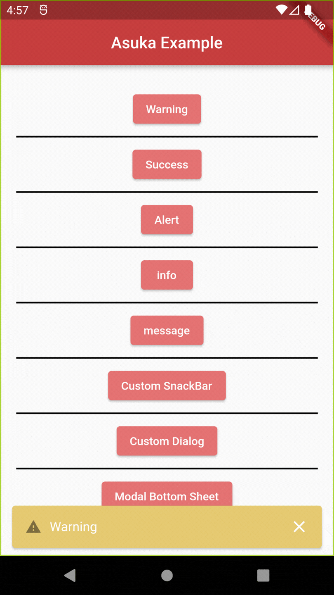
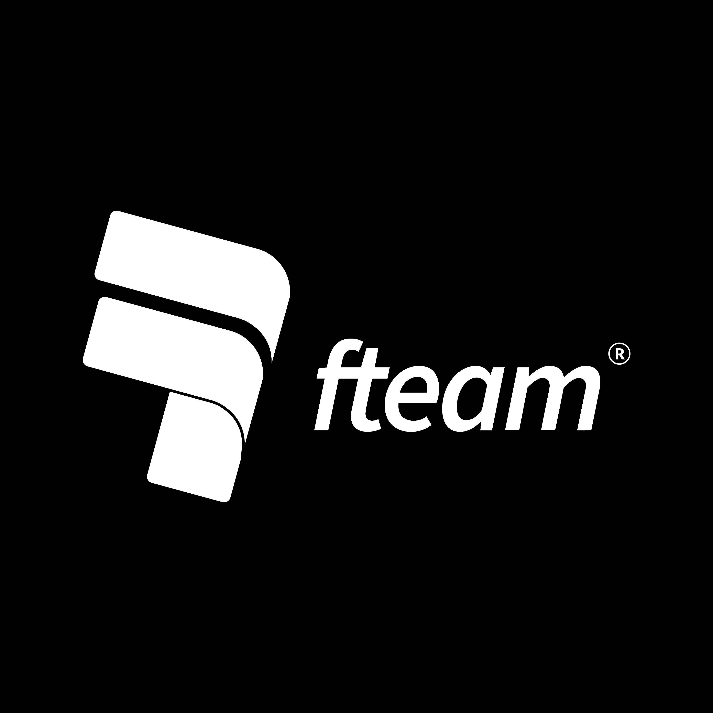
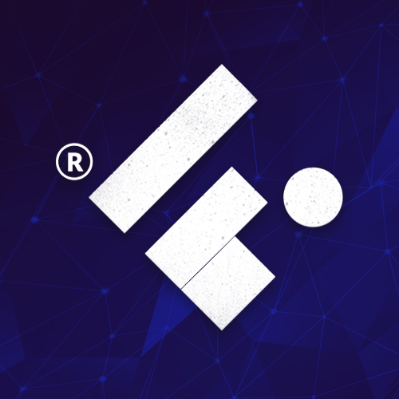

<a name="readme-top"></a>


<h1 align="center">ASUKA - Snackbars, Dialogs and more, the simple way.</h1>

<!-- PROJECT LOGO -->
<br />
<div align="center">
  <a href="https://github.com/othneildrew/Best-README-Template">
    
  </a>

  <p align="center">
    A Simple and Clean approach to Snackbars, Dialogs and ModalSheets in a single provider.
    <br />
    <a href="https://github.com/othneildrew/Best-README-Template"><strong>Explore the docs »</strong></a>
    <br />
    <br />
    <a href="https://github.com/othneildrew/Best-README-Template">View Demo</a>
    ·
    <a href="https://github.com/othneildrew/Best-README-Template/issues">Report Bug</a>
    ·
    <a href="https://github.com/othneildrew/Best-README-Template/issues">Request Feature</a>
  </p>

<br>

<!--  SHIELDS  ---->

[](https://pub.dev/packages/asuka)
[](https://github.com/Flutterando/asuka/blob/master/LICENSE)
[](https://pub.dev/packages/asuka/score)
[](https://github.com/Flutterando/asuka/graphs/contributors)
[](https://github.com/Flutterando/asuka/graphs/contributors)


[](https://pub.dev/publishers/flutterando.com.br/packages)
[](https://www.youtube.com/flutterando)
</div>

<!----
About Shields, some recommendations:
+-+
Build - GithubWorkflow ou Github Commit checks state
CodeCoverage - Codecov
Chat - Discord (already set to Flutterando in the example)
License - Github
Rating - Pub Likes, Pub Points and Pub Popularity (if still in early stages, we 		    recommend only Pub Points since it's controllable)
Social - GitHub Forks, Github Org's Stars (if using Flutterando as the main org),  	    YouTube Channel Subscribers (Again, using Flutterando, as set in the   		    example)
--->

<br>

<!-- TABLE OF CONTENTS -->
<details>
  <summary>Table of Contents</summary>
  <ol>
    <li>
      <a href="#about-the-project">About The Project</a>
      <ul>
        <li><a href="#sponsors">Sponsors</a></li>
      </ul>
    </li>
    <li><a href="#getting-started">Getting Started</a></li>
    <li><a href="#how-to-use">How to Use</a></li>
    <li><a href="#features">Features</a></li>
    <li><a href="#contributing">Contributing</a></li>
    <li><a href="#license">License</a></li>
    <li><a href="#contact">Contact</a></li>
    <li><a href="#acknowledgments">Acknowledgments</a></li>
  </ol>
</details>

<br>

<!-- ABOUT THE PROJECT -->
## About The Project

<br>
<Center>

</Center>

<br>

Asuka is a Dart package that aims to simplify and keep a clean approach when implementing some visual elements from Flutter like Snackbars, Dialogs and ModalSheets. 
With few and intuitive lines of code you can have those in your project in a lot less time than  


<p align="right">(<a href="#readme-top">back to top</a>)</p>

<!-- SPONSORS -->
## Sponsors

<a href="https://fteam.dev">
    
  </a>

<p align="right">(<a href="#readme-top">back to top</a>)</p>
<br>


<!-- GETTING STARTED -->
## Getting Started

To get Asuka in your project follow either of the instructions below:

a) Add Asuka as a dependency in your Pubspec.yaml:
 ```yaml
   dependencies:
     asuka: any
``` 

b) Use Dart Pub:
```sh
  dart pub add asuka
```

<br>


## How to Use

Add the following code where you call your Material App:

```dart
import 'package:asuka/asuka.dart';

MaterialApp(
    builder: Asuka.builder,
    navigatorObservers: [
       Asuka.asukaHeroController //This line is needed for the Hero widget to work
    ],
);
``` 
Now you just have to call the named constructors for each widget that you want to use: 

```dart
import 'package:asuka/asuka.dart';

Asuka.showSnackBar(SnackBar(
    content: Text("Hello World"),
));

AsukaSnackbar.success("success").show();
```

<br>

_For more examples, please refer to the [Documentation](https://example.com)_

<p align="right">(<a href="#readme-top">back to top</a>)</p>


<!-- ROADMAP -->
## Features

- ✅ Snackbars
- ✅ Dialog
- ✅ BottomSheet
- ✅ ModalBottomSheet
- ✅ Overlay 

Right now this package has concluded all his intended features. If you have any suggestions or find something to report, see below how to contribute to it. 

<p align="right">(<a href="#readme-top">back to top</a>)</p>


<!-- CONTRIBUTING -->
## Contributing

[Contributing Guidelines](https://github.com/angular/angular/blob/main/CONTRIBUTING.md)

Contributions are what make the open source community such an amazing place to learn, inspire, and create. Any contributions you make are **greatly appreciated**.

If you have a suggestion that would make this better, please fork the repo and create a pull request. You can also simply open an issue with the appropriate tag. 
Don't forget to give the project a star! Thanks again!

1. Fork the Project
2. Create your Feature Branch (`git checkout -b feature/AmazingFeature`)
3. Commit your Changes (`git commit -m 'Add some AmazingFeature'`)
4. Push to the Branch (`git push origin feature/AmazingFeature`)
5. Open a Pull Request

Remember to include a tag, and to follow [Conventional Commits](https://www.conventionalcommits.org/en/v1.0.0/) and [Semantic Versioning](https://semver.org/) when uploading your commit and/or creating the issue. 

<p align="right">(<a href="#readme-top">back to top</a>)</p>


<!-- LICENSE -->
## License

Distributed under the MIT License. See `LICENSE.txt` for more information.

<p align="right">(<a href="#readme-top">back to top</a>)</p>


<!-- CONTACT -->
## Contact

Flutterando Community
- [Discord](https://discord.gg/qNBDHNARja)
- [Telegram](https://t.me/flutterando)
- [Website](https://www.flutterando.com.br)
- [Youtube Channel](https://www.youtube.com.br/flutterando)
- [Other useful links](https://linktr.ee/flutterando)


<p align="right">(<a href="#readme-top">back to top</a>)</p>

<!----
  TODO: Escrever as Contributing Guidelines
->

<!-- ACKNOWLEDGMENTS -->
## Contributors 

<a href="https://github.com/flutterando/asuka/graphs/contributors">
  
</a>
<!-- Bot para Lista de contribuidores - https://allcontributors.org/  -->
<!-- Opção (utilizada no momento): https://contrib.rocks/preview?repo=flutterando%2Fasuka -->


<p align="right">(<a href="#readme-top">back to top</a>)</p>

<!-- ACKNOWLEDGMENTS -->
## Maintaned by

---

<br>
<p align="center">
  <a href="https://www.flutterando.com.br">
    
  </a>
  <p align="center">
    Built and maintained by <a href="https://www.flutterando.com.br">Flutterando</a>.
  </p>
</p>


<!-- MARKDOWN LINKS & IMAGES -->
<!-- https://www.markdownguide.org/basic-syntax/#reference-style-links -->

<!-- [Choose an Open Source License](https://choosealicense.com)
[GitHub Emoji Cheat Sheet](https://www.webpagefx.com/tools/emoji-cheat-sheet)
[Malven's Flexbox Cheatsheet](https://flexbox.malven.co/)
[Malven's Grid Cheatsheet](https://grid.malven.co/)
[Img Shields](https://shields.io)
[GitHub Pages](https://pages.github.com)
[Font Awesome](https://fontawesome.com)
[React Icons](https://react-icons.github.io/react-icons/search) 

[contributors-shield]: https://img.shields.io/github/contributors/othneildrew/Best-README-Template.svg?style=for-the-badge
[contributors-url]: https://github.com/othneildrew/Best-README-Template/graphs/contributors
[forks-shield]: https://img.shields.io/github/forks/othneildrew/Best-README-Template.svg?style=for-the-badge
[forks-url]: https://github.com/othneildrew/Best-README-Template/network/members
[stars-shield]: https://img.shields.io/github/stars/othneildrew/Best-README-Template.svg?style=for-the-badge
[stars-url]: https://github.com/othneildrew/Best-README-Template/stargazers
[issues-shield]: https://img.shields.io/github/issues/othneildrew/Best-README-Template.svg?style=for-the-badge
[issues-url]: https://github.com/othneildrew/Best-README-Template/issues
[license-shield]: https://img.shields.io/github/license/othneildrew/Best-README-Template.svg?style=for-the-badge
[license-url]: https://github.com/othneildrew/Best-README-Template/blob/master/LICENSE.txt
[linkedin-shield]: https://img.shields.io/badge/-LinkedIn-black.svg?style=for-the-badge&logo=linkedin&colorB=555
[linkedin-url]: https://linkedin.com/in/othneildrew
[product-screenshot]: images/screenshot.png
[Next.js]: https://img.shields.io/badge/next.js-000000?style=for-the-badge&logo=nextdotjs&logoColor=white
[Next-url]: https://nextjs.org/
[React.js]: https://img.shields.io/badge/React-20232A?style=for-the-badge&logo=react&logoColor=61DAFB
[React-url]: https://reactjs.org/
[Vue.js]: https://img.shields.io/badge/Vue.js-35495E?style=for-the-badge&logo=vuedotjs&logoColor=4FC08D
[Vue-url]: https://vuejs.org/
[Angular.io]: https://img.shields.io/badge/Angular-DD0031?style=for-the-badge&logo=angular&logoColor=white
[Angular-url]: https://angular.io/
[Svelte.dev]: https://img.shields.io/badge/Svelte-4A4A55?style=for-the-badge&logo=svelte&logoColor=FF3E00
[Svelte-url]: https://svelte.dev/
[Laravel.com]: https://img.shields.io/badge/Laravel-FF2D20?style=for-the-badge&logo=laravel&logoColor=white
[Laravel-url]: https://laravel.com
[Bootstrap.com]: https://img.shields.io/badge/Bootstrap-563D7C?style=for-the-badge&logo=bootstrap&logoColor=white
[Bootstrap-url]: https://getbootstrap.com
[JQuery.com]: https://img.shields.io/badge/jQuery-0769AD?style=for-the-badge&logo=jquery&logoColor=white
[JQuery-url]: https://jquery.com  -->
